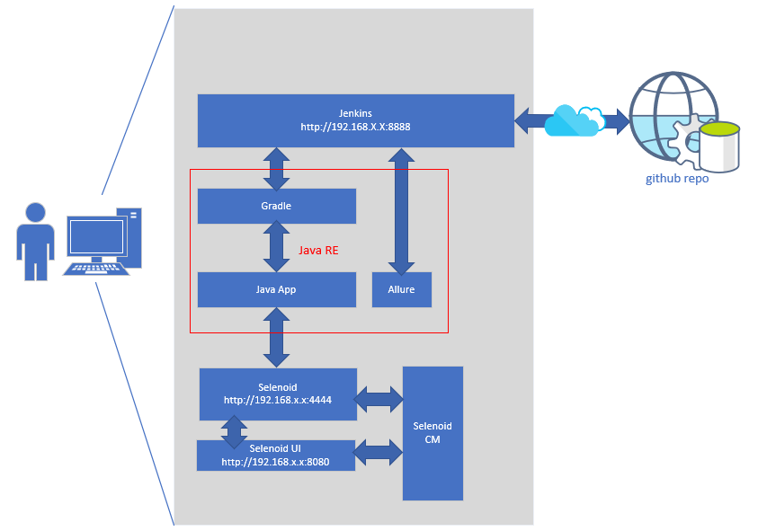

# Инструкция по настройке локального тестового стенда для QA Automation для тех, кто ни разу...
## Инструменты
1. Ваш личный ПеКа
2. VirtualBox
3. Установочный диск ubuntu 18.04 LTS (ISO-образ)
4. Git for windows
5. Putty
## Где это можно использовать
1. Локальный тестовый стенд в виртуальной машине (собственно, этот самый пример)
2. Настройка VPS, например, на каком-нибудт Digital Ocean
## Времени будет потрачено
Всего времени будет потрачено на создание тестового стенда: от 90 до 120 минут.
## Что будет сделано в результате:

<<<<<<< HEAD
Очень прямо схематично | 
-----------------------|-----------------------
Примечание:| Серое на картинке — это виртуальная машина!
1. Создадим виртуальную машину 
2. Установим на нее Ubuntu
3. Настроим доступ к Ubuntu через ssh
   1. Пользователь + пароль
   2. ssh + public key
4. Внутри поставим
   1. Java
   2. Gradle
   3. Git
   4. Jenkins
      1. Параметры для Java.
      2. Параметры для Git.
      3. Параметры для Gradle.
      4. Плагины установите сами.
   5. Docker
   6. Selenoid + его UI
5. Узнаем некоторые команды для линукс.
=======
Всего времени будет потрачено на создание тестового стенда: от 90 до 120 минут.

>>>>>>> bde5ef12bc18f29d3cfd7685d3768a3603bb8972
[Погнали к Оглавлению](./src/000%20toc.md)
