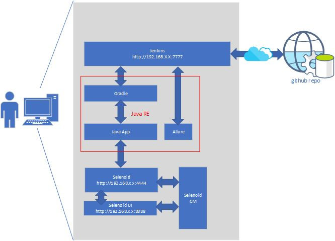

# the План
- [ ] [Создадим виртуальную машину.](005%20vm%20and%20ubuntu.md)
- [ ] [Установим на нее Ubuntu.](005%20vm%20and%20ubuntu.md)
- [ ] [Проверим, что все установилось.](006%20checkWeAreOkay.md) 
- [ ] [Да! Еще выучим пару команд линуха.](006%20checkWeAreOkay.md)
- [ ] [Настроим ssh на локальной Windows машине.](007%20sshLocalWindows.md)
- [ ] [Настроим ssh сервер на Ubuntu.](008%20sshOnVm.md)
- [ ] [Настроим аутентификацию при помощи публичного ключа на Ubuntu.](009%20ssh-passwordless.md)
- [ ] [Начнем работать с Ubuntu только через терминал.](009%20ssh-passwordless.md)
- [ ] [Установим JDK.](010%20InstallJDK.md) 
- [ ] [Установим SDK.](011%20SDK.md) 
- [ ] [Установим Gradle.](012%20GradleInstall.md)
- [ ] [Установим Jenkins.](013%20InstallJenkins.md)
- [ ] [Установим Docker.](014%20DockerSelenoid.md) :whale2:
- [ ] [Установим Selenoid.](014%20DockerSelenoid.md) :octocat: :thumbsup:
[Оглавление](./000%20toc.md)
# Что мы вообще тут делаем
Очень прямо схематично | 
-----------------------|-----------------------
Примечание:| Серое на картинке — это виртуальная машина! 

[Оглавление](./000%20toc.md)